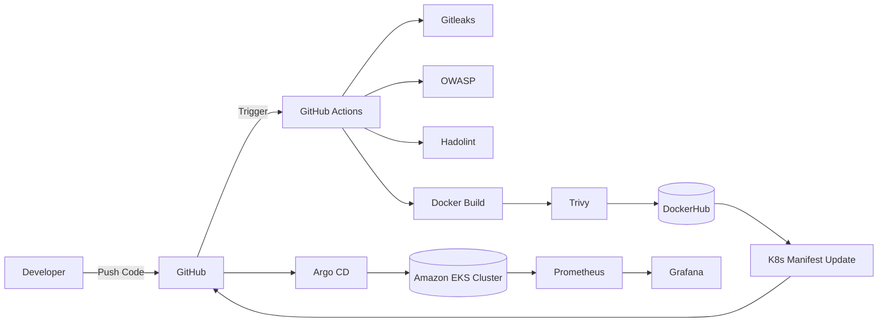

# 🚀 GitOps Blogging Application (DevSecOps Enabled)


---

## 📌 Project Overview

This project is a **full-stack blogging application** built using modern web technologies and deployed using a **complete GitOps + DevSecOps pipeline**.

It demonstrates **end-to-end automation**, starting from code commit to secure deployment on a **Kubernetes (Amazon EKS) cluster**, ensuring scalability, security, and reliability.

---

## ✨ Key Features

* 📝 Create, Read, Update, Delete (CRUD) blog posts
* 🔐 Secure DevSecOps CI/CD pipeline
* ⚡ Fully automated deployment using GitOps
* 🐳 Containerized application using Docker
* ☸️ Kubernetes orchestration on Amazon EKS
* 🔍 Integrated security scanning at multiple stages
* 📊 Monitoring with Prometheus & Grafana
* 🔄 Continuous deployment with Argo CD

---

## 🛠️ Tech Stack

| Layer            | Technology          |
| ---------------- | ------------------- |
| Frontend         | React.js            |
| Backend          | Node.js (Express)   |
| Containerization | Docker              |
| Orchestration    | Kubernetes (EKS)    |
| CI/CD            | GitHub Actions      |
| GitOps           | Argo CD             |
| Monitoring       | Prometheus, Grafana |

---

## 🏗️ Architecture Diagram



---

## 🔄 CI/CD + DevSecOps Workflow

### Step-by-Step Pipeline

1. 👨‍💻 Developer pushes code to GitHub
2. ⚙️ GitHub Actions pipeline is triggered

### 🔐 Security & Quality Checks

* 🔍 **Gitleaks** → Detects secrets in code
* 🛡️ **OWASP Dependency Check** → Finds vulnerable dependencies
* 🐳 **Hadolint** → Lints Dockerfile

### 🏗️ Build & Security

* Docker image is built
* 🔎 **Trivy** scans image for vulnerabilities

### 🚀 Deployment Preparation

* Image is pushed to DockerHub
* Kubernetes manifests are updated with new image tag

### 🔁 GitOps Deployment

* Argo CD continuously monitors GitHub repository
* Detects manifest changes
* Automatically syncs and deploys to EKS

✅ **Argo CD is fully configured and actively running this application on the Amazon EKS cluster.**

---

## 🧰 Tools Used

* Gitleaks
* OWASP Dependency Check
* Hadolint
* Trivy
* Docker
* Kubernetes
* GitHub Actions
* Argo CD
* Prometheus
* Grafana

---

## 📁 Folder Structure

```
project-root/
│
├── frontend/           # React app
├── backend/            # Node.js API
├── k8s/                # Kubernetes manifests
├── .github/workflows/  # CI/CD pipelines
├── Dockerfile
├── docker-compose.yml
└── README.md
```
---

## ☸️ Deployment Process (EKS + Argo CD)

1. Build and push Docker image
2. Update Kubernetes manifests
3. Push changes to GitHub
4. Argo CD detects changes
5. Automatically deploys to EKS cluster

📌 Argo CD ensures **continuous synchronization** between GitHub and the cluster.

---

## 📊 Monitoring Setup

* **Prometheus** collects metrics from Kubernetes cluster
* **Grafana** visualizes metrics via dashboards

Example metrics:

* CPU usage
* Memory usage
* Pod health
* Application performance

---

## 📄 License

This project is licensed under the MIT License.

---

## ⭐ Final Note

This project showcases **real-world DevSecOps practices**, combining:

* CI/CD automation
* Security-first pipeline
* GitOps deployment
* Kubernetes orchestration

Perfect for **DevOps portfolios, interviews, and production-ready architecture demonstrations**.

---
