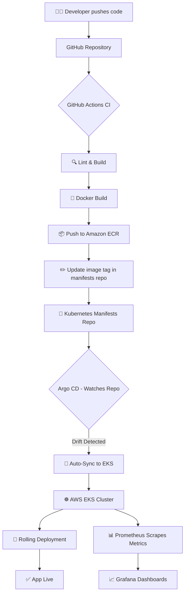

# 🛒 E-Commerce Platform — GitOps on AWS EKS

<div align="center">


**A production-grade, cloud-native e-commerce platform — engineered end-to-end with modern DevOps, GitOps, and Infrastructure-as-Code practices on AWS.**

[Architecture](#-architecture) · [Tech Stack](#-tech-stack) · [CI/CD Pipeline](#-cicd-pipeline) · [Deployment](#-deployment) · [Monitoring](#-monitoring) · [Learnings](#-key-learnings)

</div>

---

## 📌 Project Overview

This project is a **DevOps and Cloud Engineering showcase** built around a production-ready e-commerce web application. While the application frontend was adapted from an open-source codebase, the **entire cloud infrastructure, CI/CD pipeline, container orchestration, GitOps workflow, and observability stack** were designed and implemented from scratch.

> **Core Focus:** Demonstrating real-world DevOps engineering — infrastructure provisioning, automated delivery pipelines, Kubernetes cluster management, and full-stack observability on AWS.

### ✨ What Makes This Project Stand Out

| Capability | Implementation |
|---|---|
| **Infrastructure as Code** | Entire AWS infrastructure provisioned with Terraform — repeatable, versioned, destroy-safe |
| **Container Orchestration** | Kubernetes on AWS EKS with managed node groups, IAM roles, and autoscaling |
| **CI Pipeline** | GitHub Actions — lint, build, Docker image push to ECR on every commit |
| **GitOps CD** | Argo CD continuously syncs Kubernetes manifests from Git to EKS — Git is the single source of truth |
| **Observability** | Prometheus scrapes cluster metrics; Grafana dashboards provide real-time visibility |
| **Production Workflow** | Feature branches → PR → CI → image tag update → Argo CD auto-sync → EKS rollout |

---

## 🏗 Architecture

```
┌─────────────────────────────────────────────────────────────────────────┐
│                          Developer Workflow                              │
│                                                                         │
│   Developer → git push → GitHub → GitHub Actions CI → ECR (Docker)     │
│                                         │                               │
│                                   Manifest Repo ◄──── Image Tag Update  │
│                                         │                               │
│                                      Argo CD                            │
│                                         │                               │
│                              ┌──────────▼──────────┐                   │
│                              │     AWS EKS Cluster  │                   │
│                              │  ┌────────────────┐  │                   │
│                              │  │   Deployment   │  │                   │
│                              │  │  (Next.js App) │  │                   │
│                              │  └───────┬────────┘  │                   │
│                              │          │            │                   │
│                              │  ┌───────▼────────┐  │                   │
│                              │  │ Service / ALB  │  │                   │
│                              │  └────────────────┘  │                   │
│                              │                      │                   │
│                              │  Prometheus + Grafana│                   │
│                              └──────────────────────┘                   │
│                                         │                               │
│                              AWS: VPC · EKS · ECR · IAM · ALB          │
└─────────────────────────────────────────────────────────────────────────┘
```

### GitOps Flow Diagram



---

## 🧰 Tech Stack

### Application Layer
| Technology | Purpose |
|---|---|
| **Next.js** | Full-stack React framework — SSR + API routes |
| **React** | Component-based UI |
| **Node.js** | Runtime environment |

### DevOps & Infrastructure Layer
| Technology | Purpose |
|---|---|
| **Docker** | Application containerization |
| **Kubernetes (K8s)** | Container orchestration |
| **AWS EKS** | Managed Kubernetes control plane |
| **AWS ECR** | Private Docker image registry |
| **AWS VPC / ALB / IAM** | Networking, load balancing, and access control |
| **Terraform** | Infrastructure as Code — provision all AWS resources |
| **GitHub Actions** | CI pipeline — build, test, push |
| **Argo CD** | GitOps-based Continuous Delivery |
| **Prometheus** | Metrics collection and alerting |
| **Grafana** | Visualization and dashboards |

---

## 📁 Project Structure

```
ecommerce-gitops-eks/
│
├── app/                          # Next.js application source
│   ├── components/               # React components
│   ├── pages/                    # Next.js pages & API routes
│   ├── public/                   # Static assets
│   └── styles/                   # Global styles
│
├── Dockerfile                    # Production-optimized multi-stage build
├── .dockerignore
│
├── terraform/                    # Infrastructure as Code
│   ├── main.tf                   # Root module
│   ├── variables.tf              # Input variables
│   ├── outputs.tf                # Output values
│   ├── vpc.tf                    # VPC, subnets, IGW, route tables
│   ├── eks.tf                    # EKS cluster + managed node groups
│   ├── iam.tf                    # IAM roles and policies
│   └── ecr.tf                    # ECR repository
│
├── k8s/                          # Kubernetes manifests
│   ├── deployment.yaml           # App Deployment with resource limits
│   ├── service.yaml              # LoadBalancer / ALB service
│   ├── ingress.yaml              # Ingress rules
│   ├── configmap.yaml            # Environment configuration
│   └── namespace.yaml            # Namespace definition
│
├── argocd/                       # Argo CD Application manifests
│   └── application.yaml          # Argo CD Application CRD
│
├── monitoring/                   # Observability stack
│   ├── prometheus-values.yaml    # Helm values for kube-prometheus-stack
│   └── grafana-dashboard.json    # Custom Grafana dashboard export
│
└── .github/
    └── workflows/
        └── ci.yaml               # GitHub Actions CI pipeline
```

---

## ⚙️ CI/CD Pipeline

### Continuous Integration — GitHub Actions

Every push to `main` or a pull request triggers the CI pipeline:

```yaml
# .github/workflows/ci.yaml (summary)

Pipeline Stages:
  1. Checkout code
  2. Set up Node.js environment
  3. Install dependencies & run linter
  4. Build Next.js application
  5. Build Docker image (multi-stage, production-optimized)
  6. Authenticate to Amazon ECR
  7. Push image with commit SHA tag → ECR
  8. Update image tag in Kubernetes manifests repo (triggers Argo CD)
```

```
[Code Push] → [Lint] → [Build] → [Docker Build] → [ECR Push] → [Manifest Update]
```

### Continuous Delivery — Argo CD (GitOps)

Argo CD is deployed inside the EKS cluster and continuously watches the Kubernetes manifests repository.


**Key GitOps Principles Applied:**
- ✅ Git as the single source of truth for cluster state
- ✅ Declarative configuration — no imperative `kubectl apply` in production
- ✅ Automated sync with self-healing — drift detection and auto-correction
- ✅ Full audit trail through Git history

---


## 📊 Monitoring & Observability

The platform ships with a production-grade observability stack:

### Prometheus
- Deployed via the `kube-prometheus-stack` Helm chart
- Scrapes metrics from EKS nodes, pods, and the Next.js application
- Alerting rules configured for pod restarts, high CPU/memory, and deployment failures

### Grafana
- Pre-configured dashboards for:
  - **Cluster Overview** — node CPU, memory, pod health
  - **Deployment Health** — rollout status, replica availability
  - **Application Metrics** — request latency, error rates (if instrumented)


### Key Metrics Tracked

| Metric | Alert Threshold |
|---|---|
| Pod CPU Usage | > 80% for 5m |
| Pod Memory Usage | > 85% for 5m |
| Pod Restarts | > 3 in 10m |
| Node Not Ready | Immediate |
| Deployment Unavailable | Immediate |

---

## 🔑 Key Learnings

Working through this project delivered deep, hands-on experience with:

- **GitOps mental model** — understanding why Git-as-source-of-truth eliminates configuration drift and improves reliability
- **Argo CD internals** — Application CRDs, sync policies, self-healing, resource health checks
- **Terraform at scale** — module structure, remote state management, dependency graphs, and AWS provider nuances
- **EKS cluster management** — IAM roles for service accounts (IRSA), managed node group lifecycle, VPC CNI plugin behavior
- **Docker multi-stage builds** — significantly reducing final image size for production
- **Kubernetes resource design** — defining proper resource requests/limits, liveness/readiness probes, and rolling update strategies
- **Observability-first thinking** — instrumenting infrastructure before problems occur, not after


## 👨‍💻 Author

<div align="center">

**[Harsh Choubey]**

*DevOps & Cloud Engineer*


*Passionate about building scalable, automated, and observable cloud-native systems.*
*Open to DevOps, Cloud, and Platform Engineering roles.*

</div>

---

<div align="center">

**⭐ If this project helped or inspired you, consider starring the repo!**

*Built with 🛠️ infrastructure, ☁️ cloud, and a strong GitOps mindset.*

</div>
